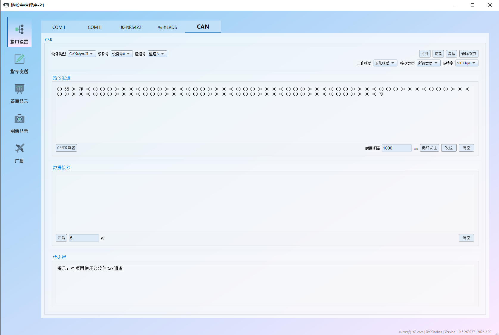
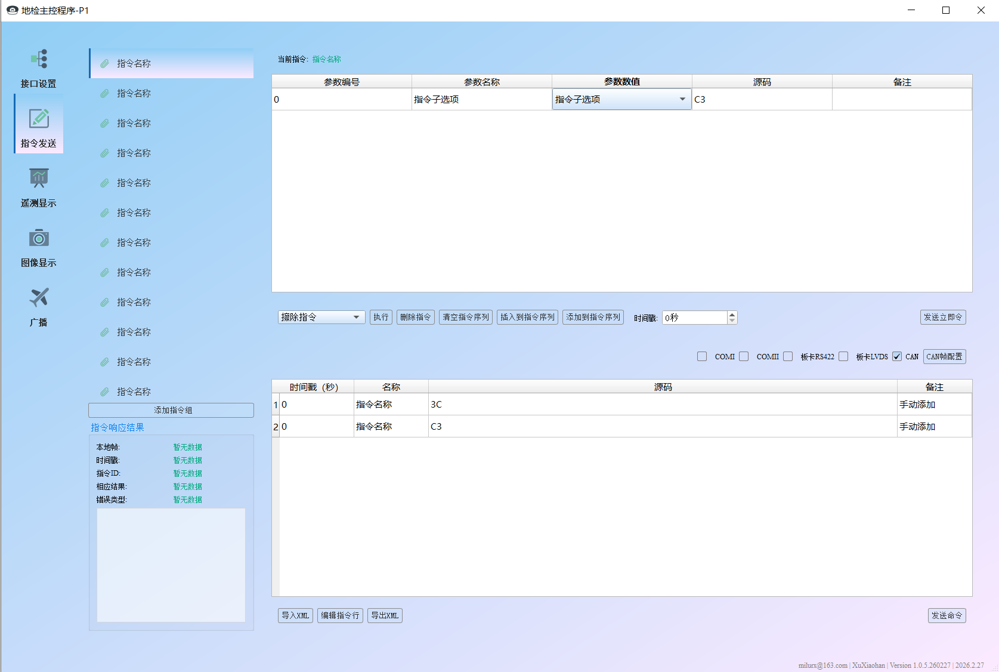
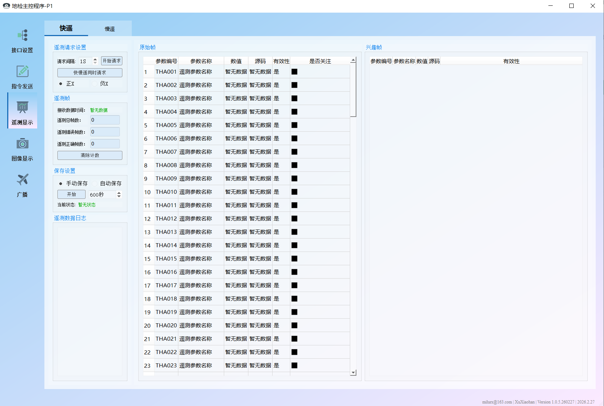
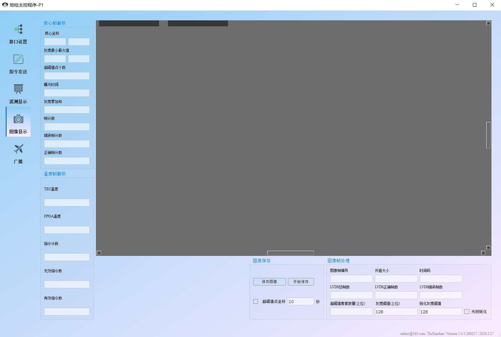
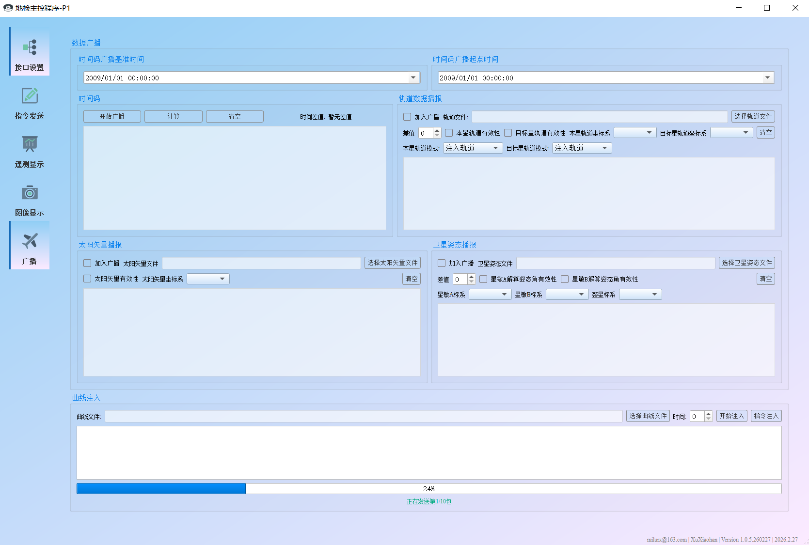

# Satellite Payload Ground Control System

Ground Control Software for Commercial Satellite Payload Applications

> A Qt-based satellite payload ground control application designed for command transmission, telemetry processing, and real-time image handling.
<p align="center">
  
</p>
<p align="center">
  
</p>
<p align="center">
  
</p>
<p align="center">
  
</p>
<p align="center">
  
</p>

---

## 📌 Overview

Satellite Payload Ground Control System is a modular ground support software developed for commercial satellite payload operations.

The system provides:

* Payload command configuration and transmission
* Telemetry data reception and frame decoding
* Real-time image display and processing
* Multi-interface communication support

It is designed for ground testing, integration validation, and in-orbit operation support scenarios.

---

## ✨ Key Features

### Command Management

* Parameterized command configuration
* Protocol packaging and checksum verification
* Batch transmission support

### Telemetry Processing

* Real-time telemetry decoding
* Frame-based protocol parsing
* Data visualization and monitoring

### Image Handling

* Real-time image stream reception
* Image decoding and rendering
* Basic image enhancement processing

### Communication Interfaces

* UART (Serial Port)
* CAN Bus
* LVDS Interface

---

## 🏗 System Architecture

```
+--------------------------------------------------+
|                    UI Layer                      |
+--------------------------------------------------+
|                       XML                        |
+--------------------------------------------------+
|        Command / Telemetry Modules / Camera      |
+--------------------------------------------------+
|               Frame Parsing Engine               |
+--------------------------------------------------+
|     Communication Abstraction Layer              |
|     (UART / CAN / LVDS)                          |
+--------------------------------------------------+
|                Hardware Interface                |
+--------------------------------------------------+
```

---

## 🛠 Development Environment

| Component | Version            |
| --------- | ------------------ |
| Framework | Qt 5.12.3          |
| Compiler  | MSVC 2017 (32-bit) |
| IDE       | Qt Creator 4.9.1   |
| OS        | Windows            |

> ⚠ The project is built with MSVC 32-bit toolchain.

---

## 📦 Dependencies

### Lua 5.4.2

Download:
https://www.lua.org/download.html

### Installation

1. Download Lua 5.4.2 (Windows 32-bit version recommended).
2. Extract required headers and library files.
3. Place them into:

```
satellitePayloadGroundControl/frameFormat/lua/
```

4. Configure include path and library path in the `.pro` file if needed.

---

## 📁 Project Structure

```
satellitePayloadGroundControl/
│
├── satellitePayloadGroundControl.pro   # Main Qt project file
│
├── CANFrame/            # CAN protocol frame handling
├── ZLGCAN/              # ZLG CAN device interface
├── serialPortModule/    # UART communication module
│
├── frameFormat/         # Generic frame parsing engine
├── frameFormatCamera/   # Camera frame processing
│
├── cardModule/          # Payload board interaction module
├── GeneralTools/        # Utility and common tools
├── UICustom/            # Custom UI components
├── XML/                 # XML configuration handling
│
├── Headers/             # Global headers
├── Sources/             # Main source files
├── Forms/               # Qt UI forms (.ui)
└── Resources/           # Qt resource files (.qrc)
```

---

## 🚀 Build Instructions

### Using Qt Creator

1. Open the .pro file in Qt Creator
2. Select Qt 5.12.3 (MSVC 2017 32-bit Kit)
3. Configure build settings
4. Build and run


---

## ⚠ Known Constraints

* Windows only
* Hardware-dependent communication layer
* Cross-platform not verified

---

## 👤 Author
XuXiaohan ​
Email: iridescenthan@gmail.com

---

## 📄 License

This project is intended for technical demonstration purposes.
Copyright © 2026 XuXiaohan.  
All rights reserved.  
